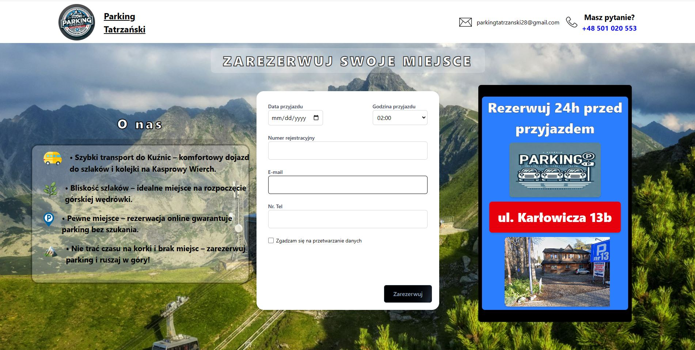
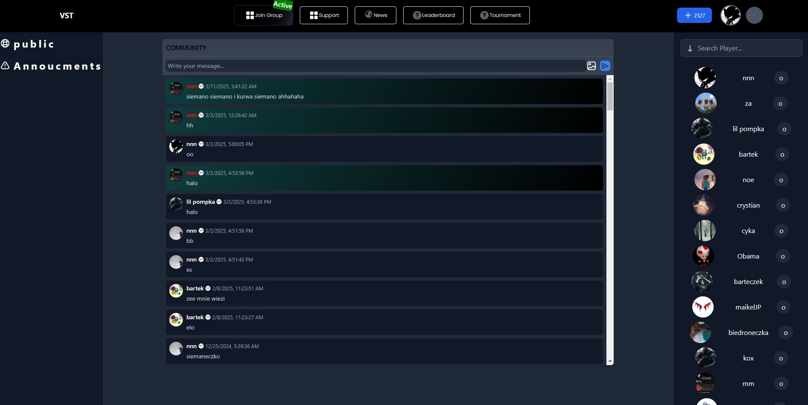

<h1 align="left" style="color: #0077b6;">Hi 👋, I'm Daniel</h1>

# 💻 Tech Stack:
             

<h3 align="center" style="color: #00b4d8;">A passionate Frontend Developer from Poland</h3>

---

### 🔨 Current Projects
#### 1. Parking Site for Small Businesses
I’m currently working on a parking site that helps small businesses manage parking spaces effectively.

#### 2. Community Website
Additionally, I’m also working on a community website:

---

### 💻 Technologies I Use

- **Frontend**: 
  - 
  - 
  - 

- **Backend**: 
  - 
  - 
  - 

---

### 📫 Get in Touch

- 📧 Email: [da.jagoda@o2.pl](mailto:da.jagoda@o2.pl)

---

### 🌐 Connect with Me

You can find me on the following platforms:
- [LinkedIn](#) 
- [Twitter](#)

---

### 🛠️ Tools & Languages I Work With

- 
- 
- 
- 
- 

---

Thank you for visiting my profile! 😄
